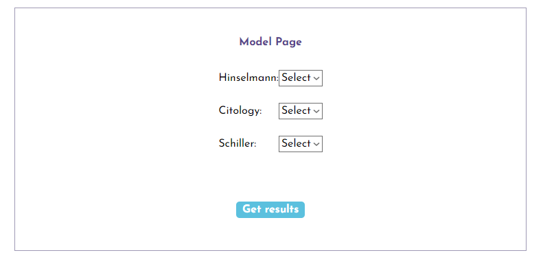
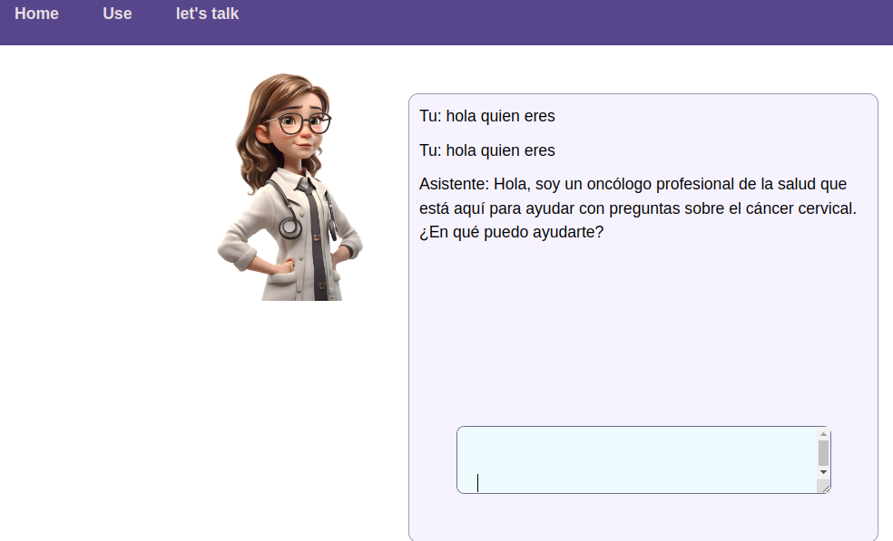

# HEALTH IA

This interface provides three sections:

1. **home**: where information is shown about the reason for the application and how the application works.

- example: 

2. **use**: where the parameters are entered so that the model returns the prediction regarding cervical cancer, this returns whether it is possible or not and a percentage of precision.

- example:

  

3. **talk us**: which is a conversation interface through the openAI GPT API, with which it is configured as a medical assistant to be able to consult everything related to the diseas.

- example:

  

## Files included

| File                                                     | Details                                                                                                                                                  |
| -------------------------------------------------------- | -------------------------------------------------------------------------------------------------------------------------------------------------------- |
| [main.tsx](src/main.tsx)                                 | is the main component                                                                                                                                    |
| [gptCommunication.tsx](src/scripts/gptCommunication.tsx) | JavaScript code that uses the OpenAI library to interact with its API. creating an OpenAI instance with an API key                                       |
| [conection.tsx](src/service/conection.ts)                | Code using AXIOS for communication with the backend                                                                                                      |
|                                                          |
| Components                                               |
| [Home](src/components/Home/)                             | Folder that contains the tsx and css files for the configuration and development of the home component files                                             |
| [Model](src/components/Model/)                           | Folder that contains the tsx and css files for the configuration and development of the Model component files                                            |
| [Nav](src/components/Nav/)                               | Folder that contains the tsx and css files for the configuration and development of the Nav component files                                              |
| [talk](src/components/talk/)                             | Folder that contains the tsx and css files for the configuration and development of the talk component files who allow communication with the openAI API |

## tools:

# React + TypeScript + Vite

This template provides a minimal setup to get React working in Vite with HMR and some ESLint rules.

Currently, two official plugins are available:

- [@vitejs/plugin-react](https://github.com/vitejs/vite-plugin-react/blob/main/packages/plugin-react/README.md) uses [Babel](https://babeljs.io/) for Fast Refresh
- [@vitejs/plugin-react-swc](https://github.com/vitejs/vite-plugin-react-swc) uses [SWC](https://swc.rs/) for Fast Refresh

## Expanding the ESLint configuration

If you are developing a production application, we recommend updating the configuration to enable type aware lint rules:

- Configure the top-level `parserOptions` property like this:

```js
export default {
  // other rules...
  parserOptions: {
    ecmaVersion: "latest",
    sourceType: "module",
    project: ["./tsconfig.json", "./tsconfig.node.json"],
    tsconfigRootDir: __dirname,
  },
};
```

- Replace `plugin:@typescript-eslint/recommended` to `plugin:@typescript-eslint/recommended-type-checked` or `plugin:@typescript-eslint/strict-type-checked`
- Optionally add `plugin:@typescript-eslint/stylistic-type-checked`
- Install [eslint-plugin-react](https://github.com/jsx-eslint/eslint-plugin-react) and add `plugin:react/recommended` & `plugin:react/jsx-runtime` to the `extends` list

Athor:

- Daniel ruiz [Linkedin](https://www.linkedin.com/in/daniel-ruiz)
- Julian Andres Mendoza Castro [Linkedin](https://www.linkedin.com/in/julian-mendoza-castro/)
- Camilo Campaz [Linkedin](https://www.linkedin.com/in/camilo-campaz-jimenez/)
